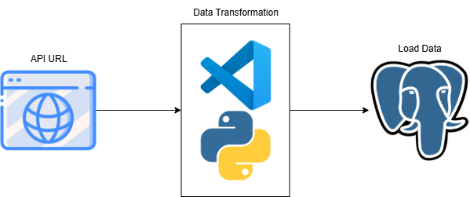

# PH-Universities-ETL

This is a basic ETL that mainly uses api url, python, and postgresql.

# Components
1. **Data Extraction** – The data is extracted from http://universities.hipolabs.com/search?country="country_name" using the requests module in Python.
2. **Data Transformation** – The extracted data is transformed in Python using pandas.
3. **Data Loading** – The transformed data is loaded into PostgreSQL, where it can be queried.

